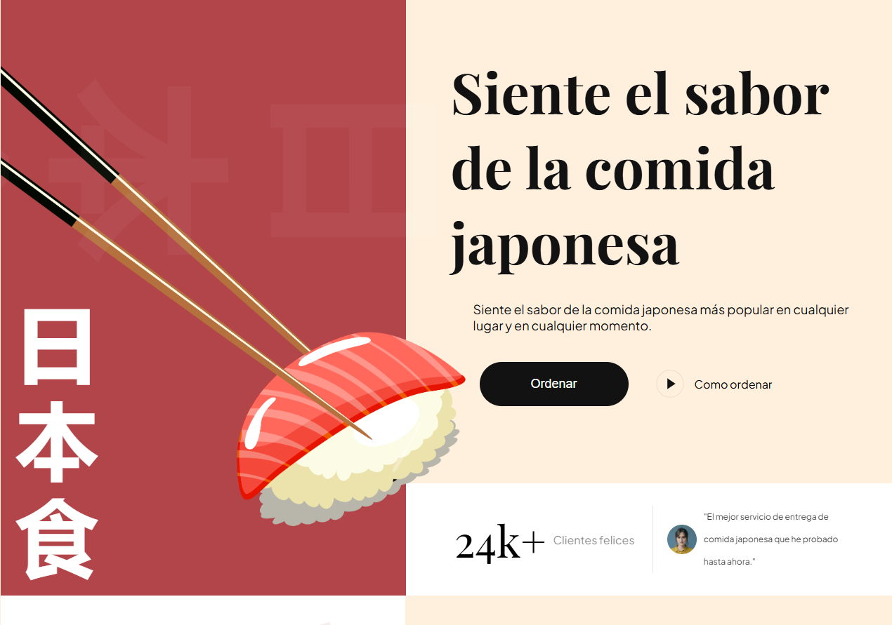

# 🍣 Sushi Store – Japanese Food Landing Page

A modern and visually appealing landing page for a Japanese food delivery service. Designed to attract customers with a clear message, vibrant visuals, and easy call-to-actions.

## 🧾 Features

- Bold hero section with impactful messaging
- Japanese-themed design and color palette
- Clear call-to-action buttons (Order Now, How to Order)
- Responsive layout
- Customer testimonials section
- Navigation menu: Menu, Food, Services, About Us

## 📁 Folder Structure

├── assets/        # Icons and images  
├── css/           # Styling files (main.css, responsive.css)  
├── js/            # JavaScript functionality (animations, toggles)  
├── public/        # Fonts, logos, and other public assets  
├── index.html     # Main HTML file  
└── README.md      # Project overview

